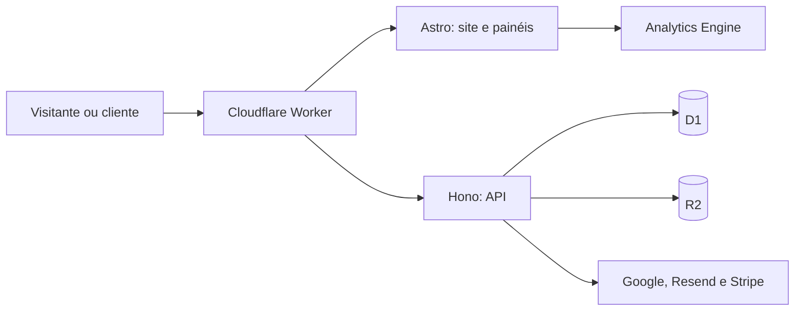

# Vira

O Vira é uma plataforma para criar e publicar páginas de vendas. O mesmo projeto reúne o site de apresentação, a autenticação, o painel de edição e as páginas públicas dos clientes.

## O que a aplicação oferece

- Página de apresentação em português e inglês.
- Acesso por código de seis dígitos enviado ao e-mail, e-mail e senha, ou conta Google.
- Edição, prévia e publicação de uma página de vendas por conta, com cinco opções de layout (Guardião, Central, Perfil, Estúdio e Clássico) e tipografia configurável (Outfit, Bricolage Grotesque, Inter, Instrument Serif e Gilda Display).
- Assistente de IA em cada página publicada: responde perguntas simples dos visitantes com base no conteúdo cadastrado no banco de dados, em português ou inglês.
- Teste gratuito de um dia e planos mensal, anual e vitalício.
- Publicação em subdomínio da plataforma ou em domínio próprio.
- Upload de imagens, métricas básicas e gerenciamento da conta.
- Instalação como PWA da plataforma, dos painéis e de cada página pública, inclusive em domínio próprio. Cada cliente pode configurar nome do aplicativo, favicon, ícone e cores do seu site.
- Painel administrativo separado para acompanhar clientes, domínios e assinaturas e configurar preços, integrações e e-mails automáticos.

## Tecnologias

| Camada                  | Tecnologia                                                                                   | Função                                                          |
| ----------------------- | -------------------------------------------------------------------------------------------- | --------------------------------------------------------------- |
| Interface               | [Astro](https://astro.build/) e TypeScript                                                   | Páginas renderizadas no servidor e componentes da interface.    |
| API                     | [Hono](https://hono.dev/) e TypeScript                                                       | Roteamento e execução das rotas `/api/*` no Worker.             |
| Hospedagem              | [Cloudflare Workers](https://developers.cloudflare.com/workers/)                             | Execução da aplicação e das páginas publicadas.                 |
| Dados                   | [Cloudflare D1](https://developers.cloudflare.com/d1/)                                       | Contas, sessões, páginas, domínios, planos e configurações.     |
| Inteligência artificial | [Cloudflare Workers AI](https://developers.cloudflare.com/workers-ai/)                       | Respostas do assistente de cada página.                         |
| Imagens                 | [Cloudflare R2](https://developers.cloudflare.com/r2/)                                       | Armazenamento dos arquivos enviados pelos clientes.             |
| Métricas                | [Cloudflare Analytics Engine](https://developers.cloudflare.com/analytics/analytics-engine/) | Contagem de visualizações e interações nas páginas.             |
| Estilos e componentes   | [Tailwind CSS](https://tailwindcss.com/) e [daisyUI](https://daisyui.com/)                   | Estilos e componentes de interface sem React.                   |
| Dados no navegador      | [TanStack Query Core](https://tanstack.com/query/latest/docs/framework/vanilla/overview)     | Consultas, mutações, cache e atualização das chamadas de API.   |
| Acesso                  | [Google Identity Services](https://developers.google.com/identity/gsi/web/guides/overview)   | Entrada com a conta Google, com validação do token no servidor. |
| E-mails                 | [Resend](https://resend.com/docs)                                                            | Links de acesso e avisos de site, assinatura e término.         |
| Pagamentos              | [Stripe](https://docs.stripe.com/)                                                           | Checkout, assinaturas e portal de cobrança.                     |

O Astro renderiza o conteúdo público no servidor, inclusive metadados e rotas de sitemap. A interface interativa do painel usa TypeScript no navegador. Não há dependência de React.

## Arquitetura



O middleware identifica o hostname da requisição e encaminha domínios dos clientes para as rotas públicas. O cadastro cria e publica imediatamente uma página inicial neutra no subdomínio do cliente. Ela fica fora dos mecanismos de busca até o cliente publicar sua primeira edição. Depois disso, o conteúdo editado fica como rascunho no D1; a publicação atualiza uma versão separada para os visitantes. A prévia e a página publicada usam o mesmo componente Astro, para manter o resultado visual consistente.

Os manifests PWA da plataforma, do painel do cliente, do painel administrativo e dos sites publicados têm escopos próprios. Nos sites dos clientes, o manifest usa a versão publicada no domínio em que foi solicitado. Os ícones enviados são convertidos em PNG nos tamanhos necessários e armazenados no R2. O service worker oferece uma mensagem ao ficar sem conexão, sem guardar páginas privadas, APIs ou conteúdo de assinaturas no navegador.

O Worker entrega as requisições `/api/*` ao Hono e as demais ao Astro. As páginas e os componentes Astro acessam o backend apenas por módulos em `frontend/src/api/`, organizados por funcionalidade e chamada. No navegador, esses módulos usam TanStack Query Core para consultas, mutações e cache. Durante a renderização no servidor, os módulos chamam as funções necessárias no mesmo Worker. O backend Hono organiza rotas, regras e consultas por funcionalidade em `backend/features/`.

O assistente de IA usa o binding `AI` do Workers AI. A landing page chama `/api/assistant/chat` para o exemplo da página inicial; cada página publicada chama `/api/public/assistant/chat`, cujo prefixo é liberado também nos domínios dos clientes. Em ambos os casos, o modelo recebe como contexto apenas o conteúdo publicado no D1 — o site do cliente ou os dados reais de planos do Vira — e é orientado a responder só com esses fatos, na língua da página. A resposta é transmitida em tempo real por Server-Sent Events, então o texto aparece sendo digitado no widget.

A guarda contra perguntas fora do escopo é feita **só por prompt**: o modelo deve recusar assuntos sem relação com a página, ignorar instruções do visitante que tentem mudar seu papel e nunca inventar fatos. Não há modelo de moderação separado. A rota pública exige a mesma origem da requisição, aplica limite por visitante e um teto diário global de 2.000 perguntas.

Nos sites publicados, o histórico da conversa é salvo em `assistant_messages` e retomado quando o visitante volta (identificado por um id anônimo aleatório guardado no navegador). A limpeza diária remove conversas com mais de 30 dias. O histórico do exemplo da landing page não é persistido.

O servidor valida as operações dos painéis e mantém a sessão em cookie `HttpOnly`, `Secure` e `SameSite=Lax`. No login com Google, verifica a assinatura e as declarações do token. O login por e-mail usa um código de seis dígitos, válido por dez minutos, com uso único e no máximo cinco tentativas; o banco guarda apenas um HMAC do código, vinculado ao e-mail e à finalidade (entrada ou redefinição de senha). Não há link nem tela intermediária de confirmação.

Senhas têm de 12 a 128 caracteres e são armazenadas com salt aleatório e PBKDF2-SHA256 (100.000 iterações, limite nativo do Workers Web Crypto). Criar ou redefinir uma senha exige um código do e-mail e revoga as sessões anteriores. Quem já usa Google ou código pode criar uma senha pelo painel, em Conta. E-mails e senhas incorretos retornam a mesma mensagem, sem indicar se a conta existe.

Envios são limitados a um por minuto e três por hora por endereço, dez por hora por IP e noventa por dia no total. Verificação de código e login por senha têm limites independentes de dez tentativas por endereço e vinte por IP a cada quinze minutos. Bloqueios retornam HTTP 429 com `Retry-After`. Os painéis têm limite agregado de 120 chamadas por minuto por conta, além dos limites por rota; a prévia tem limite próprio de 120 por minuto. Contadores e reservas de quota de mídia são atômicos.

Execute `npm test` para os testes comportamentais com **Vitest e Cloudflare Workers Pool**, no runtime workerd, com D1/R2 locais e migrações reais. Não há conexão com produção nem entrega de e-mails. A suíte cobre autenticação, sessões, CSRF, concorrência, isolamento entre clientes, publicação, uploads, exportação/exclusão, pagamentos assinados e quotas/histórico de IA. `npm run test:watch` acompanha alterações; `npm run test:auth` filtra autenticação. O deploy executa a suíte inteira antes de migrar o banco ou publicar o Worker. Consulte [SECURITY.md](SECURITY.md) para a revisão e limites das proteções.

O acesso administrativo exige que o e-mail esteja autorizado em `admin_accounts` no D1. As rotas administrativas verificam a permissão em cada requisição e registram mudanças em `admin_audit`.

Os cookies de acesso duram até 30 dias e pertencem ao hostname principal. Os endereços `www` e `app` da plataforma redirecionam para esse hostname antes de exibir páginas; a landing identifica a sessão ativa e oferece retorno direto ao painel correspondente. Os domínios dos sites dos clientes não recebem o cookie da plataforma.

As integrações externas são chamadas pelas rotas de API; suas credenciais não são enviadas ao navegador. Segredos cadastrados no painel são criptografados antes de serem armazenados no D1 e não são devolvidos pelas APIs. Preços ativos são validados na Stripe antes de serem publicados. Os bindings da infraestrutura permanecem na configuração do Worker.

Cada cadastro cria e publica a página inicial e inicia o teste de um dia na mesma operação do D1. O painel administrativo permite editar assunto e HTML e ativar ou desativar os quatro tipos de e-mail. Os avisos de site criado e assinatura confirmada entram em uma fila no D1 e são enviados pelo Worker, com novas tentativas e chave de idempotência na Resend. A fila e os lembretes são processados a cada quinze minutos. O aviso de término só é agendado para o fim do teste ou para uma assinatura com cancelamento programado; assinaturas com renovação automática não recebem esse aviso.

## Organização do projeto

| Caminho                        | Responsabilidade                                                  |
| ------------------------------ | ----------------------------------------------------------------- |
| `frontend/src/pages/`          | Rotas Astro e verificação inicial de acesso.                      |
| `frontend/src/components/`     | Componentes visuais reutilizáveis, sem consultas ou autenticação. |
| `frontend/src/pages/_views/`   | Renderização e lógica específica das telas.                       |
| `frontend/src/pages/_scripts/` | Comportamento e chamadas de API das páginas.                      |
| `frontend/src/api/`            | Uma chamada por arquivo, agrupada por funcionalidade.             |
| `frontend/src/styles/`         | Entrada do Tailwind e configuração do tema daisyUI.               |
| `backend/app.ts`               | Middleware da API e montagem das rotas Hono.                      |
| `backend/features/`            | Rotas, regras e consultas de cada funcionalidade.                 |
| `backend/platform/`            | Configuração e utilitários HTTP comuns.                           |
| `backend/jobs/`                | Tarefas agendadas pelo Worker.                                    |
| `backend/worker.ts`            | Entrada única do Worker para Hono, Astro e tarefas agendadas.     |
| `backend/migrations/`          | Evolução do esquema do D1.                                        |
| `frontend/src/middleware.ts`   | Roteamento por hostname.                                          |
| `frontend/wrangler.jsonc`      | Configuração do Worker e dos serviços Cloudflare.                 |

Cada feature do backend separa entradas em `controller/`, regras em `service/`, persistência em `repository/` e tipos/esquemas em `entities/`; `routes.ts` compõe os controllers. Componentes do frontend são visuais: autenticação, consultas e ações ficam nas páginas e seus scripts.

O painel do cliente navega por páginas: `/app` (Conteúdo), `/app/plano`, `/app/dominio` e `/app/conta`. Conteúdo usa apenas o editor interativo, com controles sobre a prévia e seleção de template dentro deles. Alterar a prévia não salva nem publica; essas ações são explícitas.

## Desenvolvimento local

Requer Node.js 22.12 ou superior. Após instalar as dependências, aplique as migrações locais e inicie o servidor:

```sh
npm install
npm run db:local
npm run dev -- --background
```

Use `npm run astro -- dev status`, `npm run astro -- dev logs` e `npm run astro -- dev stop` para acompanhar ou encerrar o servidor. Para verificar o projeto:

```sh
npm run check
npm test
npm run build
npm run format:check
```

Use `npm run format` para aplicar o padrão de formatação antes de enviar alterações.

Os fluxos que usam autenticação, pagamentos e domínios próprios dependem da configuração dos serviços externos no ambiente de execução.

## Configurar acesso com Google

Crie um cliente OAuth do tipo **Aplicativo da Web** no Google Cloud Console. Adicione `https://vira.ia.br` às origens JavaScript autorizadas e `https://vira.ia.br/api/auth/google` aos URIs de redirecionamento autorizados. Configure a tela de consentimento para usuários externos e publique o aplicativo quando estiver pronto para receber clientes. Se também usar `www.vira.ia.br`, adicione a origem e o URI equivalentes.

Cadastre o Client ID público no painel administrativo, em **Configurações**. O Google é opcional quando o acesso por e-mail está configurado. Os administradores autorizados ficam na tabela `admin_accounts`; uma instalação nova precisa cadastrar o primeiro e-mail nessa tabela antes do primeiro acesso. O deploy não altera essa autorização.

## Configurar acesso por e-mail

Crie uma conta na Resend, cadastre o domínio de envio e conclua a verificação dos registros DNS mostrados no painel. Crie uma chave de API com permissão apenas para envio. No painel administrativo, em **Configurações**, cadastre a chave `RESEND_API_KEY` e um remetente do domínio verificado em `AUTH_EMAIL_FROM`. O painel criptografa a chave antes de gravá-la no D1. O formulário de e-mail fica disponível quando os dois valores estiverem configurados e o modelo de acesso estiver ativo. Em **E-mails**, personalize os modelos e confira o histórico de envios. Os quatro HTMLs padrão ficam em `backend/features/emails/templates/`; a migração `0014_branded_email_templates.sql` os instala no D1 uma vez, preservando o estado de ativação. Ajustes posteriores feitos no painel permanecem no banco durante os próximos deploys.

## Configurar o assistente de IA

O assistente roda no próprio Worker, com o binding `AI` do Workers AI declarado em `frontend/wrangler.jsonc`. Ative o Workers AI na conta Cloudflare; o deploy cria o binding automaticamente e nenhuma chave de API precisa ser guardada no D1.

Por padrão, o Vira usa `@cf/meta/llama-3.1-8b-instruct-fp8-fast`, disponível na camada gratuita. Para trocar o modelo, preencha `AI_MODEL` no painel administrativo, em **Configurações**. Sem esse valor, o padrão é mantido. Em desenvolvimento local sem o binding, o assistente responde com um aviso amigável em vez de falhar.

O assistente fica disponível para toda conta com acesso ativo, inclusive durante o teste de um dia, e usa apenas o conteúdo publicado do site como contexto. O total de perguntas é limitado por um teto diário global de 2.000, além do limite por visitante.
