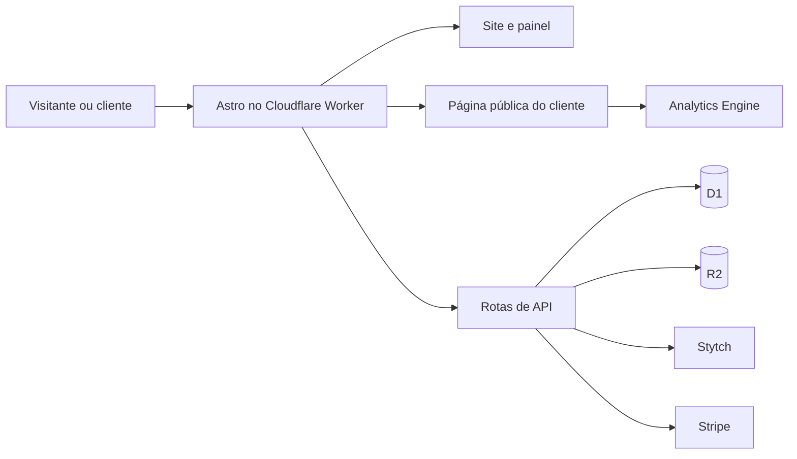

# Vira

O Vira é uma plataforma para criar e publicar páginas de vendas. O mesmo projeto reúne o site de apresentação, a autenticação, o painel de edição e as páginas públicas dos clientes.

## O que a aplicação oferece

- Página de apresentação em português e inglês.
- Acesso por número de celular, com código recebido por SMS ou WhatsApp.
- Edição, prévia e publicação de uma página de vendas por conta, com três opções de layout.
- Teste gratuito de sete dias e planos mensal, anual e vitalício.
- Publicação em subdomínio da plataforma ou em domínio próprio.
- Upload de imagens, métricas básicas e gerenciamento da conta.
- Painel administrativo separado para acompanhar clientes, domínios e assinaturas e configurar preços e integrações.

## Tecnologias

| Camada | Tecnologia | Função |
| --- | --- | --- |
| Interface e servidor | [Astro](https://astro.build/) e TypeScript | Páginas renderizadas no servidor, componentes e rotas de API no mesmo projeto. |
| Hospedagem | [Cloudflare Workers](https://developers.cloudflare.com/workers/) | Execução da aplicação e das páginas publicadas. |
| Dados | [Cloudflare D1](https://developers.cloudflare.com/d1/) | Contas, sessões, páginas, domínios, planos e configurações. |
| Imagens | [Cloudflare R2](https://developers.cloudflare.com/r2/) | Armazenamento dos arquivos enviados pelos clientes. |
| Métricas | [Cloudflare Analytics Engine](https://developers.cloudflare.com/analytics/analytics-engine/) | Contagem de visualizações e interações nas páginas. |
| Estilos e componentes | [Tailwind CSS](https://tailwindcss.com/) e [daisyUI](https://daisyui.com/) | Estilos e componentes de interface sem React. |
| Estado de dados no painel | [TanStack Query Core](https://tanstack.com/query/latest/docs/framework/vanilla/overview) | Cache e atualização de dados carregados pelas APIs. |
| Acesso e proteção | [Stytch Consumer Auth](https://stytch.com/docs/consumer-auth/authentication/otps/api) e [Cloudflare Turnstile](https://developers.cloudflare.com/turnstile/) | Códigos de acesso por SMS ou WhatsApp e proteção dos formulários. |
| Pagamentos | [Stripe](https://docs.stripe.com/) | Checkout, assinaturas e portal de cobrança. |

O Astro renderiza o conteúdo público no servidor, inclusive metadados e rotas de sitemap. A interface interativa do painel usa TypeScript no navegador. Não há dependência de React.

## Arquitetura



O middleware identifica o hostname da requisição e encaminha domínios dos clientes para as rotas públicas. O conteúdo editado fica como rascunho no D1; a publicação cria uma versão separada para os visitantes. A prévia e a página publicada usam o mesmo componente Astro, para manter o resultado visual consistente.

O servidor valida as operações dos painéis e mantém a sessão em cookie `HttpOnly`, `Secure` e `SameSite=Lax`. O acesso administrativo exige que o celular esteja na lista `admin_phones` do D1, além da verificação por código. As rotas administrativas verificam a permissão em cada requisição e registram mudanças em `admin_audit`.

As integrações externas são chamadas pelas rotas de API; suas credenciais não são enviadas ao navegador. Segredos cadastrados no painel são criptografados antes de serem armazenados no D1 e não são devolvidos pelas APIs. Preços ativos são validados na Stripe antes de serem publicados. Os bindings da infraestrutura permanecem na configuração do Worker.

## Organização do projeto

| Caminho | Responsabilidade |
| --- | --- |
| `src/pages/` | Páginas do site, painel, páginas públicas e endpoints de API. |
| `src/components/` | Componentes de apresentação e renderização das páginas. |
| `src/server/` | Regras de autenticação, cobrança, domínios, dados e contas. |
| `src/lib/` | Tipos e validação do conteúdo das páginas. |
| `src/middleware.ts` | Roteamento por hostname. |
| `src/worker.ts` | Entrada do Worker e tarefas agendadas. |
| `migrations/` | Evolução do esquema do D1. |
| `scripts/` | Comandos de apoio ao desenvolvimento e à configuração. |

## Desenvolvimento local

Requer Node.js 22.12 ou superior. Após instalar as dependências, aplique as migrações locais e inicie o servidor:

```sh
npm install
npm run db:local
npx astro dev --background
```

Use `npx astro dev status`, `npx astro dev logs` e `npx astro dev stop` para acompanhar ou encerrar o servidor. Para verificar o projeto:

```sh
npm run check
npm run build
```

Os fluxos que usam autenticação, pagamentos, proteção contra bots e domínios próprios dependem da configuração dos serviços externos no ambiente de execução.
